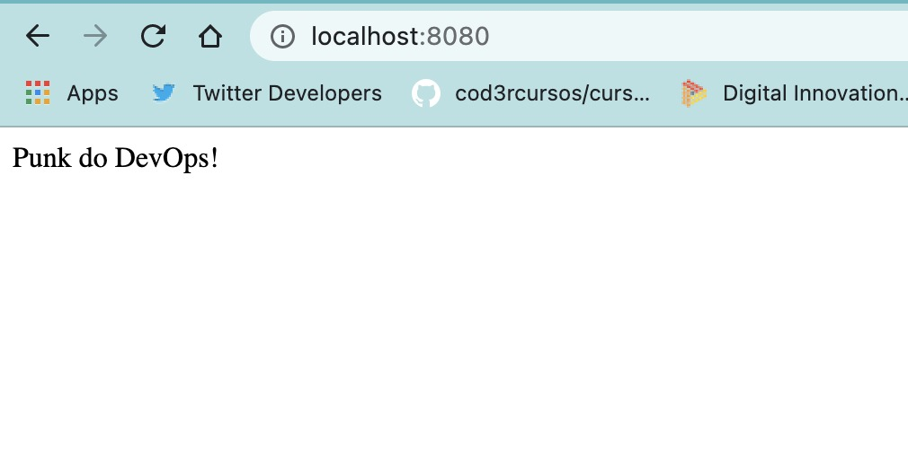

# Dia 1 - Docker

Neste primeiro dia foi ensinado sobre docker, desde onde surgiu, para onde vai, que problema resolve, até suas nuances de containers, imagens e construção de um arquivo base. 

Durante as aulas foram apresentadas formas de pesquisa em relação a [documentação oficial](https://docs.docker.com/engine/reference/commandline/run/), para que pudessemos saber onde encontrar toda a lista de parametros necessários para execução do Dockerfile

## Prática
Dentro da aula pudemos ver o build e execução de uma aplicação em node.js.

### **Dockerfile**:
Dentro do arquivo podemos ver a primeira linha onde temos:

```
    FROM node:14
```

Esta parte é responsável por escolher que imagem utilizaremos como base, como é uma aplicação em node, puxamos como base a imagem do próprio Node, a versão 14 no caso.

```
    WORKDIR /usr/src/app
    COPY package*.json ./
```
Aqui *"setamos"* nosso diretório padrão de trabalho dentro da imagem, e copiamos o arquivo package.json( o "*" serve para pegar o package-lock.json caso exista) e manda-lo para dentro do nosso diretório de trabalho.
```
    RUN npm install
    COPY . .
```
Executando esses dois passos acima fazemos a instalação das libs que estão dentro do [package.json](https://github.com/thiagobeppe/semana_dev_ops/dia_um/package.json) e copia-se o resultado a instalação para dentro do workdir.

Por fim
```
    EXPOSE 8080
    CMD ["node", "server.js"]
```
Aqui pode-se ver que estamos expondo a porta 8080 do container, porque que esterá rodando a nossa aplicação js. Então executamos o comando "node server.js" dentro do container para subir o servidor.

#### **Subindo o o container**
Primeiramente precisamos buildar a aplicação, podemos fazer executando o comando```docker build -t docker-linux-tips .``` dentro da pasta **dia_um**, onde está localizado o dockerfile
* -t: Adiciona uma tag a imagem, para que possamos executá-la de forma mais fácil
* . : Roda o comando na pasta local

Após o build acontecer, podemos colocar o container em execução usando o comando ```docker run -p "8080:8080" --name dlt -d docker-linux-tips```.
* -p : Mapeia a porta 8080 do seu computador para a porta 8080 do container, caso quisessemos utilizar outra porta poderiamos colocar "5432:8080" aí toda requisição feita na porta 5432 do pc seria redirecionada para a 8080 do container.
* --name : Adiciona um nome ao seu container
* -d : De *dettach* para não travar seu terminal com a execução do container
* docker-linux-tips: Nome da imagem , utilizada na tag de build.

Como resultado, ao acessar ```locahost:8080``` do seu navegador podemos ver o resultado da imagem abaixo


------
[Link para a aula](https://www.youtube.com/watch?v=hL4QgGhwjSI) </br>
[LinkedIn](https://www.linkedin.com/in/thiagobeppe/)
